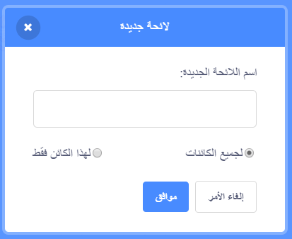

## مساعدة الكمبيوتر

هل تتذكر بضع خطوات إلى الوراء ، حيث قلت لك أن تدون بعض قيمك المفضلة لـ `زيادة`{:class="block3variables"} و `درجات`{:class="block3variables"},تلك التي أعطت أفضل الأنماط؟ إذا لم تقم بذلك ، فلا تقلق: يمكنك فقط مشاهدة البرنامج العشوائي وهو يعمل لفترة من الوقت الآن وتدوين المجموعات التي تعطي نتائج رائعة.

ستقوم بتعليم Scratch تلك المجموعات من القيم، بحيث يمكن استخدامها لصنع صور رائعة!

للقيام بذلك ، ستحتاج إلى **لائحة**. ستجد اللوائح مع المتغيرات في قسم **المتغيرات**. مثلما فعلت مع المتغيرات الخاصة بك، ستحتاج إلى إنشاء لائحتك أولاً!

\--- task \---

Click **Make a List**, and enter `Degrees List`{:class="block3variables"} as the name.



\--- /task \---

Your list, which is empty at the moment, will appear on the Stage, and you'll see a bunch of blocks for it in **Variables**.


\--- task \---

Make another list called `Increase List`{:class="block3variables"}

\--- /task \---

\--- task \---

Now, by clicking on the little plus sign (**+**) at the bottom of the lists, add in the first pair of values of `increase`{:class="block3variables"} and `degrees`{:class="block3variables"} you liked, each value into the right list. Do this again to add the second pair of values. This will be enough for now — you'll add the rest of the value pairs you like later!


Make sure that the `degrees`{:class="block3variables"} value and the `increase`{:class="block3variables"} value that worked well together are at the same position in the `Degrees List`{:class="block3variables"} and the `Increase List`{:class="block3variables"}. They need to be there so your program can match them up again using their position!

\--- /task \---

Now you have the lists, you just need to get your code to read them and loop over them! To do this, you’re going to use a new variable to act as a counter, some **incrementing**, and an `if then`{:class="block3control"} **Control** block.

## \--- collapse \---

## title: ما معنى التزايد؟

To increment something means to add something to it.

You will use a variable to act as a counter to keep track of what position you're at in your lists. To move through the lists, you'll keep incrementing the counter by `1` (so, adding `1` to it) until you get to the end of the list.

\--- /collapse \---

\--- task \---

Create a new variable called `counter`{:class="block3variables"}, and update your code to look like this:

```blocks3
    عند نقر العلم الاخضر
    اجعل [counter v] مساوياً [0]
    كرر باستمرار 
+        اذا < (عداد) = (طول [لائحة زيادة] :: لائحة)> 
+            اجعل [عداد] مساوياً [0]
        نهاية
 +       غير [عداد] بمقدار بمقدار (1)
        اجعل [عداد] مساويا [0]
+       اجعل [زيادة] مساويا (العنصر (عداد) من [لائحة زيادة] :: لائحة)
+       اجعل [درجات] مساويا (العنصر (عداد) من [لائحة درجات] :: لائحة) 
        أرفع القلم
        امسح الكل
        اذهب إلى x: (0) y: (0)
        اجعل لون القلم مساوياً [#4a6cd4]
        أنزل القلم
        كرر حتى <touching [edge v] ?> 
            تحرك (خطوات) خطوة
            استدر باتجاه الساعة (درجات) درجة
            غير [خطوات] بمقدار (زيادة)
        نهاية
    نهاية
```

\--- /task \---

Notice the new blocks that:

1. تجعل `عداد`{:class="block3variables"} مساوياً `0`, خارج جميع الحلقات.
2. تتحقق مما إذا كان الرقم المخزن في `عداد`{: class = "block3variables"} هو طول القائمة ، وإذا كان الأمر كذلك، فقم بتعيين ` عداد ` {: class = "block3variables"} إلى `0`. هذا يعني أن هذا المتغير سيكون دائمًا رقم الموضع في اللوائح، ولن يزيد عن ذلك.
3. تضيف `1` إلى `عداد`{:class="block3variables"}.
4. تختار العنصر من `قائمة زيادة`{: class = "block3variables"} الموجودة في الموضع الموصوف بواسطة `عداد`{:class="block3variables"}، ووضعه في متغير `زيادة` {: class = "block3variables"}. تفعل نفس الشيء في `قائمة الدرجات` {: class = "block3variables"} و متغير `درجات`{: class = "block3variables"}.

## \--- collapse \---

## title: كيف هذه التعليمات البرمجية تعمل؟

This is what happens when you run your program:

1. ضبط ` العداد ` {: class = "block3variables"} إلى ` 0 `.
2. ابدا حلقة `كرر باستمرار`{:class="block3control"}.
3. تحقق مما إذا كان `عداد`{:class="block3variables"} (`0`) هو نفس طول `قائمة زيادة`{:class="block3variables"}(`2`). ليس كذلك.
4. غير `عداد`{:class="block3variables"} بمقدار`1`. الان `عداد`{:class="block3variables"} = `1`.
5. اجعل `خطوات`{:class="block3variables"} مساوياً `0`.
6. احصل على العنصر في الموضع المسمى بـ `عداد`{:class="block3variables"} (`1`) في `لائحة زيادة`{:class="block3variables"}, وضعه في متغير`زيادة`{:class="block3variables"}.
7. احصل على العنصر في الموضع المسمى بـ `عداد`{:class="block3variables" (`1`) في `لائحة درجات`{:class="block3variables"}, وضعه في`درجات`{:class="block3variables"}.
8. افعل كل الأشياء المتعلقة برسم الأنماط.
9. ابدا حلقة `إلى الأبد`{: class = "block3control"} من جديد:
10. تحقق مما إذا كان `عداد`{:class="block3variables"} (`1`) هو نفس طول `قائمة زيادة`{:class="block3variables"}(`2`). ليس كذلك.
11. غير `عداد`{:class="block3variables"} بمقدار`1`. الان `عداد`{:class="block3variables"} = `2`.
12. اجعل `خطوات`{:class="block3variables"} مساوياً `0`.
13. احصل على العنصر في الموضع المسمى بـ `عداد`{:class="block3variables"} (`2`) في `لائحة زيادة`{:class="block3variables"}, وضعه في متغير`زيادة`{:class="block3variables"}.
14. احصل على العنصر في الموضع المسمى بـ `عداد`{:class="block3variables" (`2`) في `لائحة درجات`{:class="block3variables"}, وضعه في`درجات`{:class="block3variables"}.
15. افعل كل الأشياء المتعلقة برسم الأنماط.
16. ابدا حلقة `إلى الأبد`{: class = "block3control"} من جديد:
17. تحقق مما إذا كان `عداد`{:class="block3variables"} (`2`) هو نفس طول `قائمة زيادة`{:class="block3variables"}(`2`). هو كذلك!
18. اجعل `عداد`{:class="block3variables"} مساوياً `0`.
19. تابع من **الخطوة 4** من هذه القائمة ، في حلقة لا تنتهي!

\--- /collapse \---

\--- task \---

Once you're happy with the code, go ahead and add the rest of the pairs of values you noted down to the `Degrees List`{:class="block3variables"} and the `Increase List`{:class="block3variables"}.

\--- /task \---

That's it! Sit back and watch your program keep drawing lovely patterns in a never-ending loop! If you want to add more patterns, you can: just add more pairs of numbers to the two lists and restart the program.