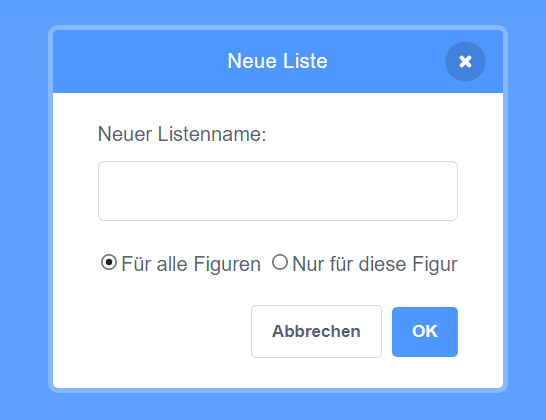

## Hilf dem Computer

Erinnerst du dich ein paar Schritte zurück, als ich dir sagte, dass du einige deiner Lieblingswerte für `erhöhen`{:class="block3variables"} und `Grad`{:class="block3variables"} notieren solltest, diejenigen die die am besten aussehenden Muster erzeugt haben? Wenn du das nicht getan hast, mach dir keine Sorgen: du kannst das zufällige Programm jetzt eine Weile laufen lassen und beobachten und die Kombinationen aufschreiben, die großartige Ergebnisse liefern.

Du wirst Scratch diese Kombinationen von Werten beibringen, damit diese nuzt um nur noch tolle Bilder zu machen!

Dazu benötigst du eine **Liste**. Du findest Listen zusammen mit den Variablen im **Variablen**-Bereich. Genau wie du es mit deinen Variablen getan hast, musst du deine Liste zuerst erstellen!

\--- task \---

Click **Make a List**, and enter `Degrees List`{:class="block3variables"} as the name.



\--- /task \---

Your list, which is empty at the moment, will appear on the Stage, and you'll see a bunch of blocks for it in **Variables**.


\--- task \---

Make another list called `Increase List`{:class="block3variables"}

\--- /task \---

\--- task \---

Now, by clicking on the little plus sign (**+**) at the bottom of the lists, add in the first pair of values of `increase`{:class="block3variables"} and `degrees`{:class="block3variables"} you liked, each value into the right list. Do this again to add the second pair of values. This will be enough for now — you'll add the rest of the value pairs you like later!


Make sure that the `degrees`{:class="block3variables"} value and the `increase`{:class="block3variables"} value that worked well together are at the same position in the `Degrees List`{:class="block3variables"} and the `Increase List`{:class="block3variables"}. They need to be there so your program can match them up again using their position!

\--- /task \---

Now you have the lists, you just need to get your code to read them and loop over them! To do this, you’re going to use a new variable to act as a counter, some **incrementing**, and an `if then`{:class="block3control"} **Control** block.

## \--- collapse \---

## title: Was bedeutet Inkrementieren?

To increment something means to add something to it.

You will use a variable to act as a counter to keep track of what position you're at in your lists. To move through the lists, you'll keep incrementing the counter by `1` (so, adding `1` to it) until you get to the end of the list.

\--- /collapse \---

\--- task \---

Create a new variable called `counter`{:class="block3variables"}, and update your code to look like this:

```blocks3
    Wenn die grüne Flagge angeklickt
    setze [Zähler v] auf [0]
    wiederhole fortlaufend 
+      falls <(Zähler) = (Länge von [erhöhen Liste v])> , dann 
+          setze [Zähler v] auf [0]
        end
+      ändere [Zähler v] um (1)
        setze [Schritte v] auf [0]
+      setze [erhöhen v] auf (Element (Zähler) von [erhöhen Liste v])
+      setze [Grad v] auf (Element (Zähler) von [Gradliste v])
        schalte Stift aus
        verstecke dich
        lösche alles
        gehe zu x: (0) y: (0)
        setze Stiftfarbe auf [#4a6cd4]
        schalte Stift ein
        wiederhole bis <wird [Rand v] berührt?> 
            gehe (Schritte) er Schritt
            drehe dich nach rechts um (Grad) Grad
            ändere [Schritte v] um (erhöhen)
        end
    end
```

\--- /task \---

Notice the new blocks that:

1. Den `Zähler`{:class="block3variables"}, außerhalb aller Schleifen, auf `0` setzen.
2. Prüfen, ob die in `Zähler`{:class="block3variables"} gespeicherte Zahl, der Länge der Liste entspricht und, falls es so ist, `Zähler`{:class="block3variables"} auf `0` setzen. Das bedeutet, dass diese Variable immer die Nummer einer Position in den Listen ist und nicht größer wird, als die Listen lang sind.
3. `1` zu `Zähler`{:class="block3variables"} hinzufügen.
4. Das Element aus der `erhöhen Liste`{: class = "block3variables"} auswählen, das sich an der Position befindet, die vom `Zähler`{:class="block3variables"} beschrieben wird, und geben es in die `erhöhen`{:class="block3variables"} Variable packen. Mache dasselbe für die `Gradliste`{:class"block3variables"} und die `Grad`{:class="block3variables"} Variable.

## \--- collapse \---

## title: Wie funktioniert der Code?

This is what happens when you run your program:

1. Setze `Zähler`{:class="block3variables"} auf `0`.
2. Starte die `fortlaufend`{:class="block3control"}-Schleife.
3. Prüfe, ob `Zähler`{:class="block3variables"} (`0`) der Länge der `erhöhen Liste`{:class="block3variables"} (`2`) entspricht. Tut es nicht.
4. Ändere den `Zähler`{:class="block3variables"} um `1`. Nun ist `Zähler`{:class="block3variables"} = `1`.
5. Setze `Schritte`{:class="block3variables"} auf `0`.
6. Hole das Element an der, durch `Zähler`{:class="block3variables"} (`1`) angegebenen, Position aus der `erhöhen Liste`{:class="block3variables"} und packe es in `erhöhen`{:class="block3variables"}.
7. Hole das Element an der durch `Zähler`{:class="block3variables"} (`1`) angegebenen Position aus der `Gradliste`{:class="block3variables"} und packe es in `Grad`{:class="block3variables"}.
8. Mache all das Zeug, was mit dem Zeichnen der Muster zu tun hat.
9. Starte die `fortlaufend`{:class="block3control"}-Schleife neu:
10. Prüfe, ob `Zähler`{:class="block3variables"} (`1`) der Länge der `erhöhen Liste`{:class="block3variables"} (`2`) entspricht. Tut es nicht.
11. Ändere den `Zähler`{:class="block3variables"} um `1`. Nun ist `Zähler`{:class="block3variables"} = `1`.
12. Setze `Schritte`{:class="block3variables"} auf `0`.
13. Hole das Element an der, durch `Zähler`{:class="block3variables"} (`2`) angegebenen, Position aus der `erhöhen Liste`{:class="block3variables"} und packe es in `erhöhen`{:class="block3variables"}.
14. Hole das Element an der durch `Zähler`{:class="block3variables"} (`2`) angegebenen Position aus der `Gradliste`{:class="block3variables"} und packe es in `Grad`{:class="block3variables"}.
15. Mache all das Zeug, was mit dem Zeichnen der Muster zu tun hat.
16. Starte die `fortlaufend`{:class="block3control"}-Schleife neu:
17. Prüfe, ob `Zähler`{:class="block3variables"} (`2`) der Länge der `erhöhen Liste`{:class="block3variables"} (`2`) entspricht. Tut er!
18. Setze `Zähler`{:class="block3variables"} auf `0`.
19. Fahre von **Schritt 4** dieser Liste an, in einer Endlosschleife, fort!

\--- /collapse \---

\--- task \---

Once you're happy with the code, go ahead and add the rest of the pairs of values you noted down to the `Degrees List`{:class="block3variables"} and the `Increase List`{:class="block3variables"}.

\--- /task \---

That's it! Sit back and watch your program keep drawing lovely patterns in a never-ending loop! If you want to add more patterns, you can: just add more pairs of numbers to the two lists and restart the program.