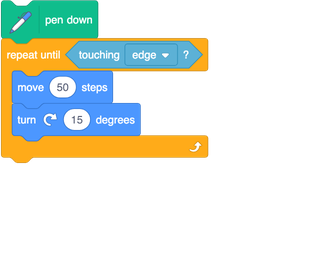
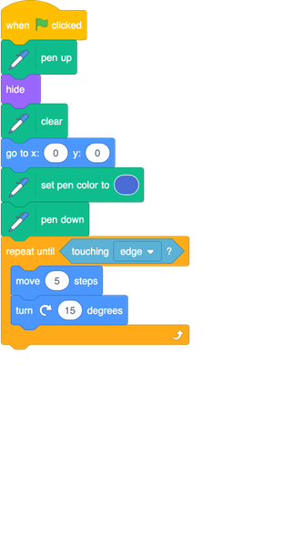
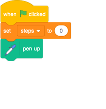
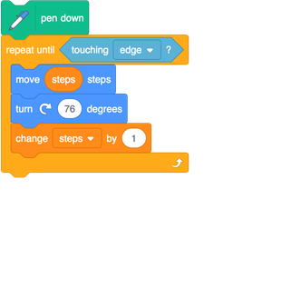

## Drawing patterns
Now you’ve got a program that draws a line, but it only draws one line. That’s a bit dull! You could use 
`forever`{:class="block3control"} loop to draw something over and over again, but then you’ll get drawings that go off the Stage!

So you need use a different type of loop called `repeat until`{:class="block3control"}, which you’ll also find in the **Control** section. This type of loop will do something over and over again, **until** a True/False condition is met. 

+ Take a `repeat until`{:class="block3control"} block from the **Control** section, and put the `move`{:class="block3motion"} and `turn`{:class="block3motion"} blocks inside it, like so: 

+ Now click the green flag to run the program a few times and see what happens. You’ll notice two things: the pen always starts by drawing a line towards the middle of the Stage, and it doesn’t stop at the edge.

--- collapse ---
---
title: Why does the pen do this?
---

The pen always starts drawing in the direction of the middle, because the first **Motion** block that runs after the `pen down`{:class="block3extensions"} block is `go to x: 0 y: 0`{:class="block3motion"}. So the pen will draw a line as it moves to the centre of the Stage.

The pen doesn't stop at the edge of the Stage, because you haven’t yet told the `repeat until`{:class="block3control"} loop what condition it’s checking. This means the condition can never be met, so the loop will run on and on. This means that right now, the loop is working like a `forever`{:class="block3control"} loop.

--- /collapse ---

+ Move the `go to x: 0 y: 0`{:class="block3motion"} block to before the `pen down`{:class="block3extensions"} block and add, from the **Pen** section, a `pen up`{:class="block3extensions"} block right at the start of your code.

Time to fix your `repeat until`{:class="block3control"} loop so that it stops when you want it to. You’re looking to figure out if the (invisible) sprite is touching the edge of the Stage, so you need a **Sensing** block — in this case, the `touching ?`{:class="block3sensing"} block. 

+ Add a `touching ?`{:class="block3sensing"} block into your `repeat until`{:class="block3control"} loop, and select `edge`. Then the loop with run **until** the (invisible) sprite touches the edge of the Stage.

+ Change the number of steps in the `move`{:class="block3motion"} block to `5`, and check that your program matches this one before you test it: 

When you run the code now, you’ll see that the drawing the pen makes stays on the Stage.

And not only that, but your program has turned into a circle-drawing program! What's happening here is that those 15-degree turns eventually add up to 360 degrees, and so your pen turns in a full circle. You're going to change the way it moves slightly to make it take slightly a longer step each time, so it spirals out. For this, you’re going to need a **variable**.

You’ve seen variables before, in the Beginner series. They're basically labeled places to store numbers or other information that you care about. You can create them in the **Variables** blocks section.

+ Make a variable called `steps`{:class="block3variables"}, and then add a `set steps to 0`{:class="block3variables"} block at the start of your program.

+ Then use the value of `steps`{:class="block3variables"} instead of the `5` in the `move`{:class="block3motion"} block, and add `change steps by 1`{:class="block3variables"} as part of your loop:

 Do you think it matters where in the loop you put the `change steps by 1`{:class="block3variables"} block?

--- collapse ---
---
title: Putting code in the right order
---

When you're deciding which order to put blocks in, think about what each block does and what you want your code to do.

In this case, you want the pen to move, then turn, over and over. Each time it does this, you want to move one extra step.

So it makes sense to put the `change steps by 1`{:class="block3variables"} block **after** the `move`{:class="blockmove"} block. However, after moving, it doesn't really matter if the pen turns first and then the number of steps changes, or if the number of steps changes first and then the pen turns instead.

--- /collapse ---

+ Now run the program, and also try changing the number of degrees around (try `76` and `120`)!
