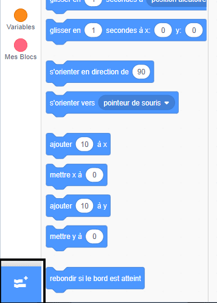
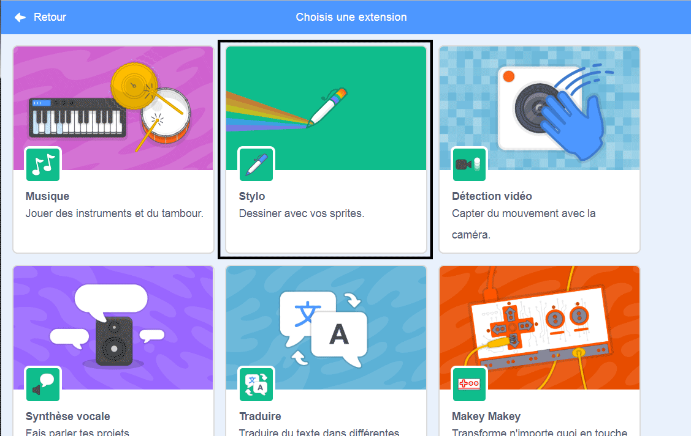
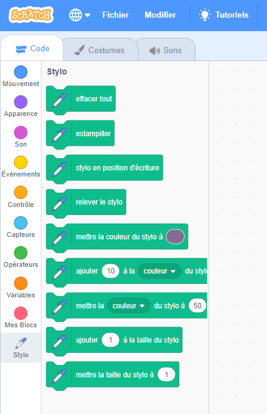

## Utiliser l'outil Stylo

Le projet que tu vas réaliser repose sur l'outil **Stylo**, qui trace une ligne derrière le centre d'un sprite lors de son déplacement. Tu vas apprendre à l'utiliser maintenant!

--- task --- Ouvre un nouveau fichier Scratch, sélectionne le sprite Chat de Scratch et fais glisser quelques blocs que tu aurais déjà vus jusqu'à ce qu'il ressemble à ceci:

```blocks3
    lorsque le drapeau vert est cliqué
    aller à x: (0) y: (0)
    déplacer de (50) pas
    tourner de cw (15) degrés
```

--- /task ---

Maintenant, il est temps de tester le stylo!

Pour utiliser les blocs de Stylo dans Scratch, tu dois ajouter l’extension **Stylo**.

--- task --- Clique sur le bouton **Ajouter une extension** dans le coin inférieur gauche.



Clique sur l'extension **Stylo** pour l'ajouter.



La section Stylo apparaît alors au bas du menu des blocs.



Dans la section **Stylo**, sélectionne le bloc `stylo en position d'écriture`{:class="block3extensions"} et ajoute-le au début de ton programme, comme suit:

```blocks3
    lorsque le drapeau vert est cliqué
+ stylo en position d'écriture
    aller à x: (0) y: (0)
```

--- /task ---

--- task --- Maintenant, clique plusieurs fois sur le drapeau vert et observe ce qui se passe. --- /task ---

Si tu peux voir les lignes derrière le sprite du chat, le stylo fonctionne et tu peux commencer à le faire dessiner des motifs vraiment cool.

Tout d'abord, tu devrais te débarrasser du sprite. Ça gêne le dessin!

--- task --- Ajoute un bloc `cacher`{:class="block3looks"} de **Attendre** au début du programme et il va disparaître.

```blocks3
    lorsque le drapeau vert est cliqué 
+ masquer
    stylo en position d'écriture
```

--- /task ---

Maintenant, tu peux changer la couleur du stylo avec un autre bloc de la section **Stylo**, mais le bloc est un peu différent des autres que tu as vus. C'est le bloc `définir la couleur du stylo sur`{:class="block3extensions"} et qui ressemble à ceci:

```blocks3
    définir la couleur du stylo sur [# 4a6cd4]
```

--- task --- Fais glisser un bloc `définir la couleur du stylo sur`{:class="block3extensions"} dans ton panneau de sprite et clipse le au- dessus du bloc `stylo en position d'écriture`{:class="block3extensions"}.

```blocks3
    lorsque le drapeau vert est cliqué
    masquer
+ définir la couleur du stylo sur [# 4a6cd4]
    stylo en position d'écriture
```

Maintenant, clique sur la case de couleur (dans le code ci-dessus, c'est la bleue), et choisis une couleur. --- /task ---

Si tu as cliqué sur le drapeau vert pour tester ton code, tu auras remarqué que les dessins du stylo ne disparaissent pas.

--- tâche --- Ajoute un `effacer`{:class="block3extensions"} bloc du **stylo** section au début de ton code pour s’occuper de cela:

```blocks3
    lorsque le drapeau vert est cliqué
+ effacer
    cacher
```

--- /task ---