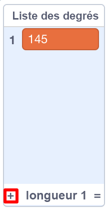

## Aider l'ordinateur

Te rappelles-tu quelques étapes en arrière, où je t'ai dit d'écrire certaines de tes valeurs préférées pour `augmenter`{:class="block3variables"} et `degrés`{:class="block3variables"}, celles qui ont donnés de meilleurs motifs? Si tu ne l'as pas fait, ne t’inquiètes pas: tu peux simplement regarder le programme aléatoire s'exécuter pendant un moment et note les combinaisons qui donnent d'excellents résultats.

Tu vas apprendre à Scratch ces combinaisons de valeurs, de sorte qu'il puisse les utiliser pour créer des images fantastiques!

Pour ce faire, tu auras besoin d'une **liste**. Tu trouveras des listes avec les variables dans la section **Variables**. Comme tu l'as fait avec tes variables, tu devras d'abord créer ta liste!

--- task --- Clique sur **Créez une liste** et entre `Liste des degrés`{:class="block3variables"} en tant que nom.


--- /task ---

Ta liste, qui est vide pour le moment, apparaîtra sur la scène et tu verras un tas de blocs pour ça dans **Variables**.


--- task --- Crée une autre liste appelée `Liste d'augmentation`{:class="block3variables"} --- /task ---

--- task --- Maintenant, en cliquant sur le petit signe plus (**+**) au bas des listes, ajoute la première paire de valeurs de `augmenter`{:class="block3variables"} et `degrés`{:class="block3variables"} que tu as aimé, chaque valeur dans la bonne liste. Répète cette opération pour ajouter la deuxième paire de valeurs. Cela suffira pour le moment - tu ajouteras le reste des paires de valeurs que tu aimes plus tard!



Assures-toi que la valeur `degrés`{:class="block3variables"} et la valeur `augmenter`{:class="block3variables"} qui ont bien fonctionné sont au même emplacement dans la `liste des degrés`{:class="block3variables"} et la `Liste d’augmentation`{:class=" block3variables "}. Ils doivent être présents pour que ton programme puisse les comparer en utilisant leur position!

--- /task ---

Maintenant que tu as les listes, il te suffit d’obtenir ton code pour les lire et les boucler dessus! Pour ce faire, tu vas utiliser une nouvelle variable pour agir en tant que compteur, des **incrémenter**, et un bloc `si alors`{:class "block3control"} **Contrôle**.

--- collapse ---
---
title: Que signifie incrémenter?
---

Incrémenter quelque chose signifie ajouter quelque chose.

Tu utiliseras une variable pour faire office de compteur et garder la trace de ta position dans tes listes. Pour te déplacer dans les listes, tu continueras à incrémenter le compteur de `1` (donc, en ajoutant `1`) jusqu'à la fin de la liste.

--- /collapse ---

--- task --- Crée une nouvelle variable appelée `compteur`{:class="block3variables"} et mets à jour ton code afin qu'il ressemble à ceci:

```blocks3
    quand le drapeau vert pressé
    mettre [compteur v] à [0]
    répéter indéfiniment 
+        si <(compteur) = (longueur de [Liste d'augmentation v])> alors 
+           mettre [compteur v] à [0]
        end
+        ajouter (1) à [compteur v]
        mettre [étapes v] à [0]
+        mettre [increase v] à (élément (compteur) de [Liste d'augmentation v])
+        mettre [degrés v] à (élément (compteur) de [Liste des degrés v])
        relever le stylo
        cacher
        effacer tout
        aller à x: (0) y: (0)
        mettre la couleur du stylo à [#4a6cd4]
        stylo en position d'écriture
        répéter jusqu'à ce que <touche le [bord v] ?> 
            avancer de (étapes) pas
            tourner droite de (degrés) degrés
            ajouter (augmenter) à [étapes v]
        end
    end
```

--- /task ---

Remarque les nouveaux blocs:

1. Définis `compteur`{:class="block3variables"} à `0`, en dehors de toutes les boucles.
2. Vérifie si le nombre stocké dans le `compteur`{:class="block3variables"} est la longueur de la liste et, dans ce cas, définis le `compteur`{:class="block3variables"} sur `0`. Cela signifie que cette variable sera toujours le numéro d'une position dans les listes et ne deviendra pas plus grande que cela.
3. Ajoute `1` au `compteur`{:class="block3variables"}.
4. Choisis l'élément de `Liste d'augmentation`{:class="block3variables"} qui est à la position décrite par `compteur`{:class="block3variables"}, et mets le dans la variable `augmenter`{:class="block3variables"}. Fais la même chose pour la variable `Liste des degrés`{:class="block3variables"} et `degrés`{:class="block3variables"}.

--- collapse ---
---
title: Comment fonctionne le code?
---

Voici ce qui se passe lorsque tu exécutes ton programme:

1. Définis `compteur`{:class="block3variables"} sur `0`.
2. Commence la boucle `répéter indéfiniment`{:class="block3control"}.
3. Vérifie si `compteur`{:class="block3variables"} (`0`) est identique à la longueur de `Liste d'augmenter`{:class="block3variables"} (`2`). Ce n’est pas le cas.
4. Change `compteur`{:class="block3variables"} par `1`. Maintenant, `compteur`{:class="block3variables"} = `1`.
5. Définis `étapes`{:class="block3variables"} sur `0`.
6. Récupère l'élément à la position nommée par `compteur`{:class="block3variables"} (`1`) dans la `Liste d'augmentations`{:class="block3variables"}, et mets le dans `augmenter`{:class="block3variables"}.
7. Récupère l'élément à la position nommée par `compteur`{:class="block3variables"} (`1`) dans la `liste des degrés`{:class="block3variables"}, et mets-le à `degrés`{:class="block3variables"}.
8. Fais tous les trucs liés au dessin des motifs.
9. Redémarre la boucle `répéter indéfiniment`{:class="block3control"}:
10. Vérifie si `compteur`{:class="block3variables"} (`1`) est identique à la longueur de `Liste d'augmentation`{:class="block3variables"} (`2`). Ce n’est pas le cas.
11. Change `compteur`{:class="block3variables"} par `1`. Maintenant, `compteur`{:class="block3variables"} = `2`.
12. Définis `étapes`{:class="block3variables"} sur `0`.
13. Récupère l'élément à la position nommée par `compteur`{:class="block3variables"} (`2`) dans la `liste de augmentations`{:class="block3variables"}, et mets le dans `augmenter`{:class="block3variables"}.
14. Récupère l'élément à la position nommée par `compteur`{:class="block3variables"} (`2`) dans la `liste des degrés`{:class="block3variables"}, et mets-le dans `degrés`{:class="block3variables"}.
15. Fais tous les trucs liés au dessin des motifs.
16. Redémarre la boucle `répéter indéfiniment`{:class="block3control"}:
17. Vérifie si `compteur`{:class="block3variables"} (`2`) est identique à la longueur de la `liste de augmentations`{:class="block3variables"} (`2`). C'est ça!
18. Définis `compteur`{:class="block3variables"} sur `0`.
19. Continue à partir de **étape 4** de cette liste, dans une boucle sans fin!

--- /collapse ---

--- task --- Une fois que tu es satisfait du code, continue et ajoute le reste des paires de valeurs que tu as notées à la `liste des degrés`{:class="block3variables"} et à la `liste d'augmentation`{:class="block3variables"}. --- /task ---

C'est tout! Pose toi et regarde ton programme continuer à dessiner de jolis motifs dans une boucle sans fin! Si tu souhaites ajouter plus de motifs, tu peux: simplement ajouter plus de paires de nombres aux deux listes et redémarrer le programme.


**Traduction de la communauté**

Ce projet a été traduit par **Jonathan Vannieuwkerke** et vérifié par **Michel Arnols**.

Nos incroyables bénévoles de traduction nous aident à donner aux enfants du monde entier la chance d'apprendre à coder. Vous pouvez nous aider à atteindre plus d'enfants en traduisant nos projets - en savoir plus sur [rpf.io/translate](https://rpf.io/translate).