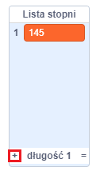

## Pomaganie komputerowi

Czy pamiętasz jak kilka kroków wstecz powiedziałem, żebyś zapisał niektóre z twoich ulubionych wartości dla zmiennych `powiększenie`{:class="block3variables"} i `stopnie`{:class="block3variables"}, które dały najlepiej wyglądające wzory? Jeśli tego nie zrobiłaś, nie martw się: możesz po prostu oglądać losowo uruchamiany program przez chwilę i zapisać te kombinacje, które dają świetne wyniki.

Nauczysz Scratch tych kombinacji wartości, aby mógł je wykorzystać do robienia niesamowitych obrazków!

Aby to zrobić, będziesz potrzebować **listy**. Listę zmiennych najdziesz w sekcji **Zmienne**. Podobnie jak w przypadku zmiennych, musisz najpierw utworzyć swoją listę!

\--- task \---

Click **Make a List**, and enter `Degrees List`{:class="block3variables"} as the name.


\--- /task \---

Your list, which is empty at the moment, will appear on the Stage, and you'll see a bunch of blocks for it in **Variables**.


\--- task \---

Make another list called `Increase List`{:class="block3variables"}

\--- /task \---

\--- task \---

Now, by clicking on the little plus sign (**+**) at the bottom of the lists, add in the first pair of values of `increase`{:class="block3variables"} and `degrees`{:class="block3variables"} you liked, each value into the right list. Do this again to add the second pair of values. This will be enough for now — you'll add the rest of the value pairs you like later!



Make sure that the `degrees`{:class="block3variables"} value and the `increase`{:class="block3variables"} value that worked well together are at the same position in the `Degrees List`{:class="block3variables"} and the `Increase List`{:class="block3variables"}. They need to be there so your program can match them up again using their position!

\--- /task \---

Now you have the lists, you just need to get your code to read them and loop over them! To do this, you’re going to use a new variable to act as a counter, some **incrementing**, and an `if then`{:class="block3control"} **Control** block.

## \--- collapse \---

## title: Co oznacza zwiększające?

To increment something means to add something to it.

You will use a variable to act as a counter to keep track of what position you're at in your lists. To move through the lists, you'll keep incrementing the counter by `1` (so, adding `1` to it) until you get to the end of the list.

\--- /collapse \---

\--- task \---

Create a new variable called `counter`{:class="block3variables"}, and update your code to look like this:

```blocks3
    kiedy kliknięto zieloną flagę
    ustaw [licznik v] na [0]
    zawsze 
+ jeżeli <(licznik) = (długość [Lista powiększenia v] :: lista)> to 
+ ustaw [licznik v] na [0]
        koniec
+ zmień [licznik v] o (1)
        ustaw [kroki v] na [0]
+ ustaw [powiększenie v] na (element (licznik) [Lista powiększenia v] :: lista)
+ ustaw [stopnie v] na (element (licznik) [Lista stopni v] :: lista)
        podnieś pisak
        ukryj
        wyczyść wszystko
        idź do x: (0) y: (0)
        ustaw kolor pisaka na [#4a6cd4]
        przyłóż pisak
        powtarzaj aż <touching [edge v] ?> 
            przesuń o (kroki) kroków
            obróć w prawo o (stopnie) stopni
            zmień [kroki v] o (powiększenie)
        koniec
    koniec
```

\--- /task \---

Notice the new blocks that:

1. Ustawiają `licznik`{:class="block3variables"} na `0`, poza wszystkimi pętlami.
2. Sprawdzają, czy liczba zapisana w zmiennej `licznik`{:class="block3variables"} jest długością listy, a jeśli tak, ustawiają zmienną `licznik`{:class="block3variables"} na `0`. Oznacza to, że ta zmienna zawsze będzie numerem pozycji na listach i nie będzie większa.
3. Dodają `1` do zmiennej `licznik`{:class="block3variables"}.
4. Wybierają element z `Listy powiększenia`{:class="zmienne block3"}, który znajduje się na pozycji opisanej przez zmienną `licznik`{:class="block3variables"}, i umieszczają go w zmiennej `powiększenie`{:class="block3variables"}. Zrób to samo dla listy `Lista stopni`{:class="block3variables"} i zmiennej `stopnie`{:class="block3variables"}.

## \--- collapse \---

## title: Jak działa ten kod?

This is what happens when you run your program:

1. Ustaw `licznik`{:class="block3variables"} na `0`.
2. Uruchom pętlę `zawsze`{:class="block3control"}.
3. Sprawdź, czy `licznik`{:class="block3variables"} (`0`) jest taki sam, jak długość listy `Lista powiększenia`{:class="block3variables"} (`2`). Nie jest.
4. Zmień `licznik`{:class="block3variables"} o `1`. Teraz `licznik`{:class="block3variables"} = `1`.
5. Ustaw zmienną `kroki`{:class="block3variables"} na `0`.
6. Weź element z pozycji wskazanej przez zmienną `licznik`{:class="block3variables"} (`1`) w liście `Lista powiększenia`{:class="block3variables"} i umieść go w zmiennej `powiększenie`{:class="block3variables"}.
7. Weź element z pozycji wskazanej przez zmienną `licznik`{:class="block3variables"} (`1`) w liście `Lista stopni`{:class="block3variables"} i umieść go w zmiennej `stopnie`{:class="block3variables"}.
8. Zrób wszystkie rzeczy związane z rysowaniem wzorów.
9. Uruchom ponownie pętlę `zawsze`{:class="block3control"}:
10. Sprawdź, czy `licznik`{:class="block3variables"} (`1`) jest taki sam, jak długość `Listy powiększenia`{:class="block3variables"} (`2`). Nie jest.
11. Zmień `licznik`{:class="block3variables"} o `1`. Teraz `licznik`{:class="block3variables"} = `2`.
12. Ustaw `kroki`{:class="block3variables"} na `0`.
13. Weź element z pozycji wskazanej przez zmienną `licznik`{:class="block3variables"} (`2`) w liście `Lista powiększenia`{:class="block3variables"} i umieść go w zmiennej `powiększenie`{:class="block3variables"}.
14. Weź element z pozycji wskazanej przez zmienną `licznik`{:class="block3variables"} (`2`) w liście `Lista stopni`{:class="block3variables"} i umieść go w zmiennej `stopnie`{:class="block3variables"}.
15. Zrób wszystkie rzeczy związane z rysowaniem wzorów.
16. Uruchom ponownie pętlę `zawsze`{:class="block3control"}:
17. Sprawdź, czy `licznik`{:class="block3variables"} (`2`) jest taki sam, jak długość `Listy powiększenia`{:class="block3variables"} (`2`). Jest!
18. Ustaw `licznik`{:class="block3variables"} na `0`.
19. Kontynuuj od **kroku 4** tej listy, w niekończącej się pętli!

\--- /collapse \---

\--- task \---

Once you're happy with the code, go ahead and add the rest of the pairs of values you noted down to the `Degrees List`{:class="block3variables"} and the `Increase List`{:class="block3variables"}.

\--- /task \---

That's it! Sit back and watch your program keep drawing lovely patterns in a never-ending loop! If you want to add more patterns, you can: just add more pairs of numbers to the two lists and restart the program.