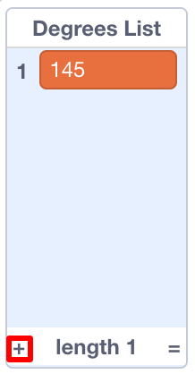

## Ajută computer-ul

Îți amintești când ți-am spus câțiva pași înapoi că trebuie să notezi unele dintre valorile tale preferate pentru `creștere`{:class="block3variables"} și `grade`{:class="block3variables"}, acelea care au generat cele mai faine șabloane? Dacă nu ai făcut acest lucru, nu îți fă griji: poți doar să urmărești programul la întâmplare pentru o vreme și să notezi combinațiile care dau rezultate excelente.

O să înveți Scratch aceste combinații de valori, astfel încât să le poată folosi pentru a face doar imagini grozave!

Pentru a face acest lucru, vei avea nevoie de o **listă**. Vei găsi listele cu variabile în secțiunea **Variabile**. La fel ca și în cazul variabilelor tale, va trebui să îți creezi prima listă!

--- task --- Dă click pe **Creează o listă** și introdu numele `Listă grade`{:class="block3variables"}.


--- /task ---

Lista ta, care este momentan goală, va apărea pe Scenă și vei vedea o grămadă de blocuri pentru ea în **Variabile**.


--- task --- Fă o altă listă numită `Listă creștere`{:class="block3variables"} --- /task ---

--- task --- Acum, dă click pe semnul plus (**+**) din partea de jos a listelor, adaugă prima pereche de valori `Creștere`{:class="block3variables"} și `Grade`{:class="block3variables"} care ți-au plăcut, fiecare valoare în lista potrivită. Fă același lucru din nou pentru a adăuga o a doua pereche de valori. Acest lucru va fi suficient pentru acum - vei adăuga restul perechilor de valori pe care le vrei mai târziu!



Asigură-te că valoarea `grade`{:class="block3variables"} și `creștere`{:class="block3variables"} care s-au potrivit bine împreună sunt în aceeași poziție în `Listă grade`{:class="block3variables"} și `Listă creștere`{:class="block3variables"}. Trebuie să fie acolo, astfel încât programul tău să poată să le potrivească din nou folosind poziția lor!

--- /task ---

Acum că ai listele, trebuie doar să obții codul pentru a le citi și a le include în buclă împreună! Pentru a face acest lucru, vei folosi o nouă variabilă pentru a acționa ca un contor, niște **incrementări** și un bloc **Control** de tip `dacă atunci`{:class="block3control"}.

--- collapse ---
---
title: Ce înseamnă incrementare?
---

A incrementa înseamnă a crește ceva prin a adăuga o valoare.

Vei utiliza o variabilă care va a acționa ca un contor pentru a urmări poziția în care se află în listele tale. Pentru a vă deplasa prin liste, veți continua să creșteți contorul cu `1` (deci adăugați `1` la acesta) până când ajungeți la sfârșitul listei.

--- /collapse ---

--- task --- Creează o variabilă nouă numită `contor`{:class="block3variables"} și actualizează codul astfel încât să arate astfel:

```blocks3
    când se dă click pe stegulețul verde
    setează [contor v] la [0]
    la infinit 
+        dacă <(contor) = (lungimea lui [Listă creștere v] :: list)> atunci 
+        setează [contor v] la [0]
        end
+        modifică [contor v] cu (1)
        setează [pași v] la [0]
+        setează [creștere v] la (element (contor) din [Listă creștere v] :: list)
+        setează [grade v] la (element (contor) din [Listă grade v] :: list)
        stilou sus
        ascunde
        șterge tot
        mergi la x: (0) y: (0)
        setează culoarea stiloului la [#4a6cd4]
        stilou jos
        repeta pana când < atinge [marginea v] ?>
            mergi (pași) pași
            rotește-te cw (grade) grade
            modifică [pași v] cu (creștere)
        end
    end
```

--- /task ---

Observă noile blocuri care:

1. Setează `contor`{:class="block3variables"} la `0`, în afara tuturor buclelor.
2. Verifică dacă numărul stocat în `counter`{:class="block3variables"} este egal cu lungimea listei și, dacă da, setează blocul `counter`{:class="block3variables"} la `0`. Asta înseamnă că această variabilă va avea întotdeauna numărul unei poziții din liste și nu va fi mai mare ca aceasta.
3. Adaugă `1` la `contor`{:class="block3variables"}.
4. Alege elementul din `Listă creștere`{:class="block3variables"} care este în poziția descrisă de `contor`{:class="block3variables"} și îl pune în în variabila `creștere`{:class="block3variables"}. Același lucru îl face și pentru `Listă grade`{:class="block3variables"} și variabila `grade`{:class="block3variables"}.

--- collapse ---
---
title: Cum funcționează codul?
---

Asta se întâmplă atunci când rulezi programul:

1. Setează blocul `contor`{:class="block3variables"} la `0`.
2. Pornește bucla `la infinit`{:class="block3control"}.
3. Verifică dacă `contor`{:class="block3variables"} (`0`) este egal cu lungimea listei `Listă creștere`{:class="block3variables"} (`2`). Nu este.
4. Schimbă `contorul`{:class="block3variables"} cu `1`. Acum, `contor`{:class="block3variables"} = `1`.
5. Setează `pași`{:class="block3variables"} la `0`.
6. Ia elementul din poziția indicată de `contor`{:class="block3variables"} (`1`) din `Listă creștere`{:class="block3variables"} și îl pune în `creștere`{:class="block3variables"}.
7. Ia elementul din poziția indicată de `contor`{:class="block3variables"} (`1`) din `Listă grade`{:class="block3variables"} și îl pune în `grade`{:class="block3variables"}.
8. Face toate lucrurile legate de desenarea șabloanelor.
9. Repornește bucla `la infinit`{:class="block3control"}:
10. Verifică dacă `contor`{:class="block3variables"} (`1`) este egal cu lungimea listei `Listă creștere`{:class="block3variables"} (`2`). Nu este.
11. Schimbă `contorul`{:class="block3variables"} cu `1`. Acum, `contor`{:class="block3variables"} = `2`.
12. Setează `pași`{:class="block3variables"} la `0`.
13. Ia elementul din poziția indicată de `contor`{:class="block3variables"} (`2`) din `Listă creștere`{:class="block3variables"} și îl pune în `creștere`{:class="block3variables"}.
14. Ia elementul din poziția indicată de `contor`{:class="block3variables"} (`2`) din `Listă grade`{:class="block3variables"} și îl pune în `grade`{:class="block3variables"}.
15. Face toate lucrurile legate de desenarea șabloanelor.
16. Repornește bucla `la infinit`{:class="block3control"}:
17. Verifică dacă `contor`{:class="block3variables"} (`2`) este egal cu lungimea listei `Listă creștere`{:class="block3variables"} (`2`). Este!
18. Setează `contor`{:class="block3variables"} la `0`.
19. Continuă de la **pasul 4** din această listă, într-o buclă care rulează la infinit!

--- /collapse ---

--- task --- Odată ce ești mulțumit de cod, continuă și adaugă restul perechilor de valori pe care le-ai notat în `Listă grade`{:class="block3variables"} și `Listă creștere`{:class="block3variables"}. --- /task ---

Asta e totul! Relaxează-te și urmărește programul tău cum desenează șabloane frumoase într-o buclă care rulează la infinit! Dacă dorești să adaugi mai multe modele, o poți face: adaugă mai multe perechi de numere în cele două liste și repornește programul.


**Traducere realizată de comunitate**

Proiectul a fost tradus de **Ines Teaca** și verificat de **Gelu Ungur**.

Traducătorii noștri voluntari ne ajută să oferim copiilor din întreaga lume șansa de a învăța programarea. Poți ajuta și tu la traducerea proiectelor noastre – află mai multe pe rpf.io/translators.